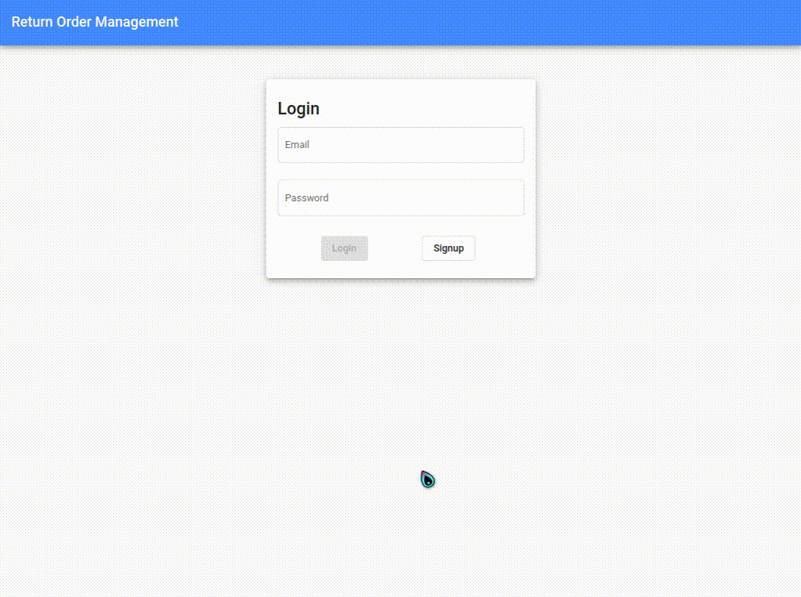

# Return Order Management

Return Order Management frontend built with *Angular*. This is the client side application of the [return_order_management_backend](https://github.com/RitamChakraborty/return_order_management_backend) application. 

### UI

For the UI, [Angular Material](https://material.angular.io/) and [SCSS](https://sass-lang.com/) was used. The application is fully responsive.

### Demo



### Running Locally

Must have *Node 16* or above and *Angular CLI* installed. Make sure to update
the [environments.ts](./src/environments/environment.ts) file to pass the correct API gateway url.

```sh
ng serve
```

Visit [localhost:4200](http://localhost:4200) to see the application running.

### Build

A docker image is uploaded
to [DockerHub@ritamchakraborty/return_order_frontend](https://hub.docker.com/repository/docker/ritamchakraborty/return_order_frontend)
.

### Deploy

Deployed to GitHub pages through [gh-pages](https://github.com/tschaub/gh-pages) npm package.

### CI/CD

A [GitHub Workflow](./.github/workflows/deploy-gh-pages.yml) has been set up to deploy automatically to GitHub Pages
with [github-pages-deploy-action](https://github.com/JamesIves/github-pages-deploy-action).

Checkout it out [here](https://ritamchakraborty.github.io/return_order_management_frontend/).
